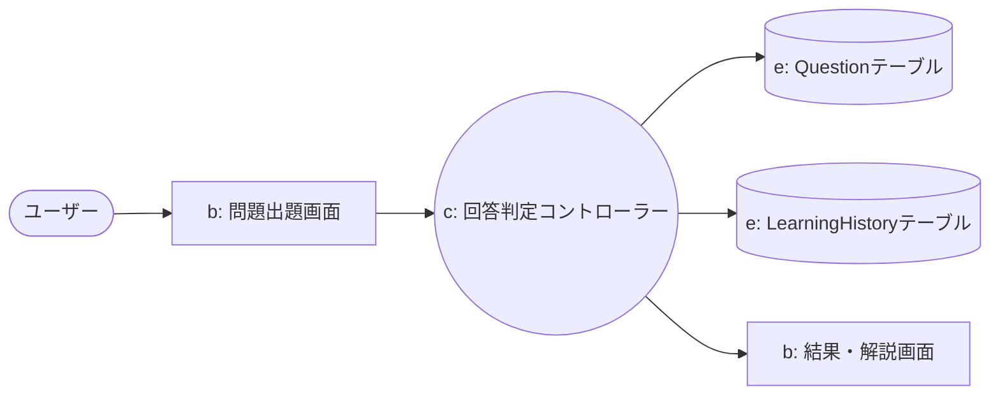
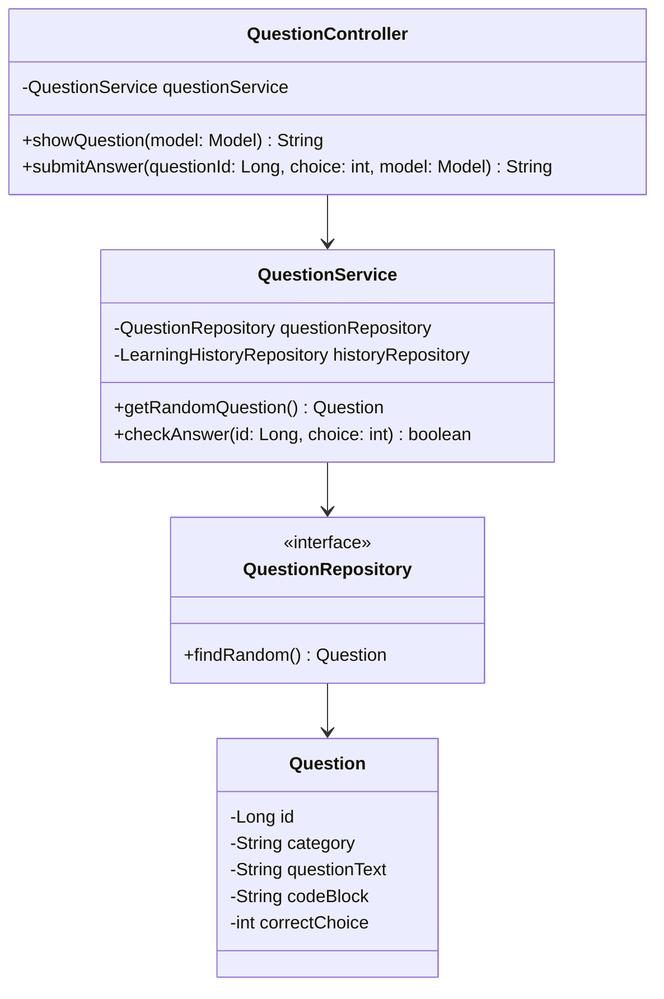
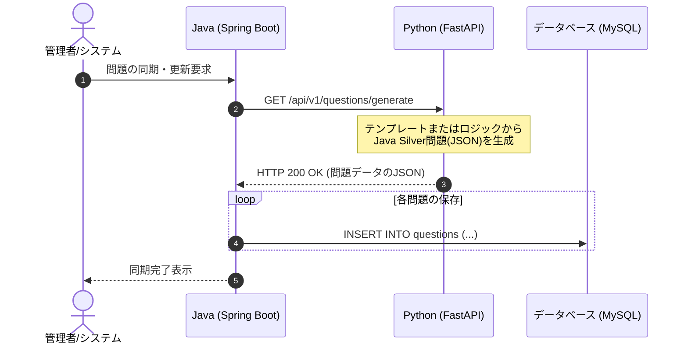

#  Java Silver 攻略！AIスマート問題集

Java SE Silver（Oracle Certified Java Programmer, Silver）の資格取得を目指すエンジニア候補生のための、ハイブリッド型・模擬試験＆学習管理システムです。
実務を意識し、**アジャイル開発手法（スクラム形式）**および**UMLを用いた設計駆動開発**を取り入れて制作しました。

---

##  1. プロジェクト概要

### 開発背景と解決する課題
- **課題：** Java Silverの市販の参考書（黒本など）は問題数が限られており、何度も解くと答えの選択肢を覚えてしまい、真の理解に繋がりにくい。
- **解決策：** Javaで堅牢な出題・履歴管理システムを構築し、Python（FastAPI）で問題データの動的加工や類似問題の生成を行うことで、ユーザーに飽きさせない「苦手克服」環境を提供します。

### 技術スタックの役割分担（ハイブリッド構成）
- **Java (Spring Boot):** 【堅牢性・画面担当】ユーザー管理、お気に入り保存、出題・正誤判定エンジン。
- **Python (FastAPI):** 【データ処理・生成担当】出題トレンドの解析、コード内数値のランダム置換、類似問題生成API。

---

## 📅 2. 開発スケジュール（アジャイル・タイムボックス）

厳格な納期（10月29日発表）に向け、1週間単位の**スプリント**でスコープ（開発範囲）をコントロールしながら開発を進行しました。

| 期日 | フェーズ / マイルストーン | 成果物・アクション |
| :--- | :--- | :--- |
| **10/06** | **機能仕様 確定** | ユースケース定義、MVP（最小限の必須機能）の選定 |
| **10/09** | **構造仕様 確定** | ロバストネス図・クラス図・シーケンス図・ER図の作成 |
| **10/13** | **プログラミング開始** | **【スプリント1】** 基盤画面、DB、Python APIの疎通確認 |
| **10/20** | **スプリント2 開始** | **【スプリント2】** 正誤判定、学習履歴保存、API連携の肉付け |
| **10/26** | **動作確認・品質向上** | 単体・結合テスト、デバッグ、リファクタリング、例外処理検証 |
| **10/28** | **納品・発表準備** | デプロイ完了、プレゼンテーション資料（スライド）作成 |
| **10/29** | **プレゼン本番** | 成果物デモ、およびアジャイル開発プロセスの発表 |

---

## 📋 3. 機能仕様 (Function Specifications)

### 🟩 コア機能（MVP）
- **ユーザー管理：** 新規会員登録、ログイン・ログアウト機能。
- **クイズ出題・判定：** 4択問題の表示、ユーザー回答の即時判定、解説の動的表示。
- **問題データ連携：** Javaが起動時または要求時に Python API から新問題データを取得し同期。

---

## 🏗 4. 構造仕様 (Structural Specifications)

### システム全体像
[ Webブラウザ (Thymeleaf/HTML5) ]
│ (HTTP)
[ Java: Spring Boot (Web・制御) ] ─── (JPA) ─── [ MySQL (データ保持) ]
│                                        ▲
│ (REST API / JSON)                      │
[ Python: FastAPI (問題生成エンジン) ] ─────────────────┘

### ① ロバストネス図（回答判定ユースケース）
画面（バウンダリ）、ロジック（コントロール）、データ（エンティティ）の境界線を明確にし、密結合を避ける設計を行いました。

### ② クラス図（Javaコア領域）
メンテナンス性と拡張性を担保するため、Springの標準的な3層アーキテクチャ（Controller - Service - Repository）を採用しています。

### ③ シーケンス図（Java ⇔ Python API 連携ループ）
JavaがPythonからJSON形式で動的問題データを取得する際のシーケンスです。

---

## 🛠 5. 実務を意識したこだわりの実装ポイント（堅牢性の担保）

- **疎結合なAPI連携とフォールバック処理**
  Java（Spring Boot）からPython（FastAPI）を呼び出す際、万が一Pythonサーバーがダウンしていても、Javaシステム全体がクラッシュしないよう、Java側に `try-catch` による**フォールバック（代替用ローカル問題の出題ロジック）**を実装しています。
- **Git / GitHub を用いたタスク管理**
  GitHub Projects（カンバン）にすべてのタスクをIssueとして切り出し、スプリントごとに「Todo -> In Progress -> Done」のステータス管理を徹底。コミットログを機能単位で細かく残すことで、開発プロセスの可視化を行いました。
